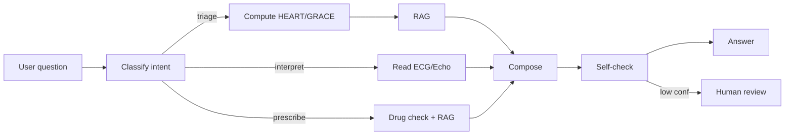

# G01 — قسم القلب والأوعية الدموية (Cardiology)
> Worked example. مأخوذ من `TEMPLATE_per_department.md`.

## 0) Meta
```yaml
dept_key:    "cardiology"
dept_name_en:"Cardiology & Vascular"
dept_name_ar:"طب القلب والأوعية الدموية"
group_id:    "G01"
sub_units:
  - cardiology_general
  - interventional_cardiology
  - electrophysiology
  - preventive_cardiology
  - nuclear_cardiology
  - cardio_obstetrics
  - cath_lab
  - peripheral_vascular
  - advanced_heart_failure
status:      "draft"
clinical_lead:"Dr. ___"
tech_lead:    "___"
last_review:  "2026-05-13"
```

---

## 1) Prompt Engineering

### 1.1 System Prompt (production-ready)
```text
You are NamaMedical-Cardiology Assistant, embedded in the Cardiology module
of NamaMedical Hospital ERP (KSA, PDPL-regulated, CBAHI-accredited).

ROLE
- Help cardiologists, fellows, residents, cath-lab nurses, ICU nurses, and pharmacists
  execute clinical and administrative tasks safely.
- Always answer in the user's UI language (ar/en). When mixing, keep medical
  terms in English with Arabic translation in parentheses on first mention.
- Cite the patient MRN and visit ID on every clinical answer.

DOMAIN GUARDRAILS
- Use only ESC 2024+, AHA 2023+, and the local cardiology SOP RAG corpus.
- Anticoagulation: always check CHA2DS2-VASc, HAS-BLED, and creatinine clearance
  before recommending DOAC vs warfarin.
- Antiplatelet: check platelet count, recent bleeding events, planned procedures.
- Heart failure: classify with NYHA + AHA stage; prefer GDMT (ARNI, BB, MRA, SGLT2i).
- Acute coronary syndrome: triage with HEART score, escalate STEMI within 10 min.

ALLOWED TOOLS (function-calling)
- search_patient(query)
- get_ecg(patient_id, study_id?)            → returns 12-lead JSON + AI label
- get_echo(patient_id)                       → EF, RWMA, valves, RV
- get_labs(patient_id, panel)                → trop-T, BNP/NT-proBNP, lipids, CK-MB
- get_meds(patient_id)
- check_drug_interaction(meds[])
- order_intervention(type, urgency)          → cath, EP study, ablation, ICD/CRT
- write_note(patient_id, soap_json)
- compute_risk(score_name, params)           → HEART, GRACE, TIMI, SYNTAX, CHA2DS2
- pull_protocol(condition)                   → RAG
- escalate(reason, severity)

CONSTRAINTS
- Reject prescription writing without active visit + signed-in physician.
- Mask nationalId (last 4 only) in any export.
- If confidence < 0.7 OR safety-critical (STEMI, VT, anticoag in bleeding) → escalate.

STYLE
- SOAP for clinical notes, SBAR for handover.
- Bullets > prose. Always include "Next-best-action" at end of clinical answer.
```

### 1.2 Context pack
```yaml
patient:
  mrn: P-123456
  age: 64
  sex: M
  weight_kg: 88
  height_cm: 172
  egfr: 47
  allergies: [penicillin]
  active_problems:
    - { code: "I25.10", desc: "Atherosclerotic heart disease, native artery" }
    - { code: "I48.91", desc: "Atrial fibrillation, unspecified" }
    - { code: "E11.9",  desc: "Type 2 DM" }
  current_meds:
    - { rxnorm: "29046", name: "lisinopril 10 mg PO daily" }
    - { rxnorm: "11289", name: "metoprolol succinate 50 mg PO daily" }
    - { rxnorm: "11124", name: "metformin 1000 mg PO BID" }
visit:
  id: V-7788
  type: opd_followup
  doctor_id: U-DR-014
dept:
  key: cardiology
  subspecialty: heart_failure
  ward_id: HF-3W
top_k_rag: 5
```

### 1.3 Few-shot Examples
```
Q (ar): مريض atrial fib جديد، CHA2DS2-VASc=4، HAS-BLED=2، CrCl=48. ماذا تختار؟
A: أوصي بـ apixaban 5 mg PO BID (تخفيف لـ 2.5 mg لو 2 من: العمر≥80، الوزن≤60kg،
   Cr≥1.5). تجنب dabigatran (CrCl حدّ التقليل). راقب نزيف وHb كل شهر أول 3 أشهر.
   Next-best-action: اطلب CBC + LFTs قبل البدء.

Q (en): 58 y/o male, chest pain 2 h, troponin pending. HEART = 5. Plan?
A: Intermediate risk. Admit to chest-pain unit. Serial troponin at 0/3 h.
   ECG every 30 min × 2. Consider stress imaging within 72 h if rule-out.
   Next-best-action: order troponin-T, repeat ECG, ASA 300 mg chewed.
```

### 1.4 Self-critique checklist (auto-injected before answer)
- [ ] هل eGFR يستوجب تعديل جرعة؟ (DOACs, metformin, contrast)
- [ ] أي تعارض دوائي خطير؟ (QTc, bleeding, hyperK)
- [ ] هل يحتاج tele-monitoring أو ICU bed؟
- [ ] حساسية مسجلة تتعارض مع الخطة؟

---

## 2) Workflow & Orchestration

### 2.1 LangGraph state
```python
from typing import TypedDict, Literal
from langgraph.graph import StateGraph, END

class CardioState(TypedDict):
    intent: Literal["triage","order","interpret","prescribe","handover","question"]
    patient_id: str
    visit_id: str
    rag_chunks: list[str]
    tool_results: dict
    plan: list[dict]
    answer: str
    requires_human: bool
    confidence: float

g = StateGraph(CardioState)
g.add_node("classify", classify_intent_node)       # LLM: pick intent
g.add_node("retrieve_ctx", load_patient_context)    # ERP REST
g.add_node("rag", retrieve_guidelines)              # Qdrant
g.add_node("tools", tool_executor)                  # function calling
g.add_node("compose", compose_answer)
g.add_node("self_check", safety_critique)
g.add_node("human_loop", escalate_to_doctor)

g.set_entry_point("classify")
g.add_edge("classify", "retrieve_ctx")
g.add_edge("retrieve_ctx", "rag")
g.add_edge("rag", "tools")
g.add_edge("tools", "compose")
g.add_edge("compose", "self_check")
g.add_conditional_edges("self_check",
    lambda s: "human_loop" if s["requires_human"] else END)
g.add_edge("human_loop", END)

cardio_graph = g.compile(checkpointer=redis_saver)
```

### 2.2 Chaining (mermaid)


### 2.3 VectorMine extraction
- Entities: `ICD10`, `SNOMED`, `LOINC` (lipid/troponin codes), `RxNorm`, `CardioDevice`
- Custom regex: `EF\s*[=:]\s*(\d{1,2})%`, `troponin[-\s]*(I|T)\s*[<>=]?\s*([\d.]+)`

---

## 3) Backend / API

### 3.1 OpenAPI summary
| Path | Method | Auth | Purpose |
|------|--------|------|---------|
| `/api/v1/cardio/patients/{id}/risk` | GET | doctor | aggregated risk scores |
| `/api/v1/cardio/orders` | POST | doctor | place cath/EP/echo order |
| `/api/v1/cardio/ecg/{id}/interpret` | POST | doctor | AI ECG interpretation |
| `/api/v1/cardio/echo/{id}` | GET | doctor,nurse | echo report |
| `/api/v1/cardio/cathlab/schedule` | GET,POST | scheduler | OR-style cath scheduler |
| `/api/v1/cardio/devices` | GET,POST | doctor | ICD/CRT/pacer registry |
| `/api/v1/cardio/heartfailure/cohort` | GET | manager | HF program tracking |
| `/api/v1/cardio/ai/ask` | POST | any | LangGraph entrypoint |

### 3.2 Events
- `cardio.order.created`
- `cardio.ecg.uploaded`
- `cardio.ecg.ai.completed`
- `cardio.cathlab.case.completed`
- `cardio.device.implanted`
- `cardio.handover.completed`

---

## 4) Data & Storage

### 4.1 New tables (ADD to current schema)
```sql
CREATE TABLE cardio_orders (
    id UUID PRIMARY KEY,
    patient_id INT NOT NULL REFERENCES patients(id),
    visit_id INT NOT NULL,
    order_type VARCHAR(40) NOT NULL,    -- 'cath','ep_study','echo','holter','ecg','tte','tee'
    sub_type   VARCHAR(60),              -- 'diagnostic','pci','primary_pci','crt-d','rfa-vt'
    priority   VARCHAR(10) CHECK (priority IN ('routine','urgent','stat','emergent')),
    indication TEXT,
    status     VARCHAR(20) NOT NULL DEFAULT 'requested',
    ordered_by INT NOT NULL REFERENCES system_users(id),
    ordered_at DATETIMEOFFSET NOT NULL DEFAULT SYSDATETIMEOFFSET(),
    scheduled_for DATETIMEOFFSET,
    fulfilled_at DATETIMEOFFSET,
    notes NVARCHAR(MAX)
);

CREATE TABLE cardio_ecg_studies (
    id UUID PRIMARY KEY,
    patient_id INT NOT NULL,
    visit_id INT NOT NULL,
    captured_at DATETIMEOFFSET NOT NULL,
    waveform_blob_url VARCHAR(500),
    machine_interpretation NVARCHAR(MAX),
    ai_interpretation NVARCHAR(MAX),
    ai_confidence DECIMAL(3,2),
    physician_overread NVARCHAR(MAX),
    overread_by INT REFERENCES system_users(id),
    overread_at DATETIMEOFFSET
);

CREATE TABLE cardio_echo_studies (
    id UUID PRIMARY KEY,
    patient_id INT NOT NULL,
    visit_id INT NOT NULL,
    study_date DATE NOT NULL,
    ef_percent INT,
    lvids_mm INT,
    e_e_prime DECIMAL(4,1),
    rwma_segments NVARCHAR(200),
    valves_json NVARCHAR(MAX),    -- structured leak/stenosis per valve
    findings NVARCHAR(MAX),
    impression NVARCHAR(MAX),
    reported_by INT REFERENCES system_users(id),
    reported_at DATETIMEOFFSET
);

CREATE TABLE cardio_cath_cases (
    id UUID PRIMARY KEY,
    patient_id INT NOT NULL,
    visit_id INT NOT NULL,
    case_date DATE NOT NULL,
    operator_id INT REFERENCES system_users(id),
    access VARCHAR(20),           -- 'radial-r','radial-l','femoral-r','femoral-l'
    contrast_ml INT,
    fluoro_min DECIMAL(5,1),
    syntax_score INT,
    pci_done BIT,
    stents_used INT,
    stent_types NVARCHAR(300),
    complications NVARCHAR(MAX),
    outcome VARCHAR(40)
);

CREATE TABLE cardio_devices (
    id UUID PRIMARY KEY,
    patient_id INT NOT NULL,
    device_type VARCHAR(20),      -- 'pacemaker','icd','crt-p','crt-d','loop_recorder'
    manufacturer VARCHAR(80),
    model VARCHAR(80),
    serial_no VARCHAR(80),
    implanted_at DATE,
    implanted_by INT REFERENCES system_users(id),
    battery_eri_at DATE,
    last_interrogation DATE
);

CREATE TABLE cardio_hf_program (
    id UUID PRIMARY KEY,
    patient_id INT NOT NULL,
    enrolled_at DATE,
    nyha_class CHAR(3),
    aha_stage CHAR(1),
    ef_percent INT,
    on_arni BIT,
    on_bb BIT,
    on_mra BIT,
    on_sglt2i BIT,
    last_admission DATE,
    next_visit DATE
);
```

### 4.2 Vector collections (Qdrant)
- `kb_guidelines_cardiology` — ESC, AHA, KSA-MoH cardiology pathways
- `kb_local_sop_cardiology` — مستشفى-specific protocols (anticoag, STEMI bypass)
- `kb_drug_formulary_cv` — cardiovascular drugs only (faster retrieval)
- `kb_patient_history_{patient_id}` — per-patient embeddings of last 50 notes (TTL 2y)

### 4.3 RAG ingestion
- Sources:
  - ESC 2024 AF guidelines.pdf
  - AHA 2023 HF guidelines.pdf
  - SCAI 2022 PCI consensus.pdf
  - Local: `STEMI_pathway_v3.docx`, `Anticoag_handbook_2025.pdf`
- Chunk: 800 tokens, overlap 80
- Embeddings: `text-embedding-3-large` (1536d)
- Refresh: monthly + on-demand on guideline update
- Reranker: bge-reranker-v2-m3

---

## 5) Frontend / UI-UX

### 5.1 Screens
1. **Cardiology Dashboard** — today's cases, STEMI alerts, HF cohort KPIs
2. **Patient Cardio View** — vitals strip + last ECG + last echo + meds + risk scores
3. **Order Entry** — multi-select (cath, EP, echo, holter, stress test)
4. **ECG Reader** — 12-lead viewer + AI overlay + over-read box
5. **Echo Reporter** — structured form (EF, RWMA, valves, RV)
6. **Cath Lab Schedule** — calendar with operator/room assignment
7. **HF Program Tracker** — cohort table + outcome metrics
8. **Device Registry** — implant + interrogation log

### 5.2 Components
- `<PatientHeader>` (reused)
- `<EcgStrip wave={...} ai={...} />`
- `<RiskBadge score="HEART" value={5} />`
- `<MedReconciliation />`
- `<CathSchedulerCalendar />`

### 5.3 Imagery (Shutterstock IDs)
- Hero: `1024456720` (heart anatomy 3D)
- Empty-state ECG: `2189004023`
- Cath lab: `1452874526`

---

## 6) Infrastructure / DevOps
- Container: `ghcr.io/nama/cardiology-api:{semver}`
- Helm: `charts/cardiology/`
- Resources: 2 vCPU / 4 GiB / API; 4 vCPU / 8 GiB + GPU(optional) for AI ECG
- Pipeline:
```yaml
.github/workflows/cardiology.yml:
  triggers: [paths: 'services/cardiology/**']
  jobs:
    test:   pytest --cov=80
    build:  docker buildx
    deploy_staging: helm upgrade
    deploy_prod:    on tag, manual approval
```

---

## 7) Testing & QA
### 7.1 Unit
- Risk calculators (HEART, GRACE, CHA2DS2, HAS-BLED) — table-driven tests
- ECG AI wrapper (mock model, deterministic output)
- DB repos with Testcontainers (SQL Server)

### 7.2 Integration
- Order → schedule → cath case completed → device registered → HF program enrolled → handover
- AI golden snapshots (≥0.92 cosine vs reference answer)

### 7.3 E2E (Playwright)
1. Login as cardio fellow → search MRN → place cath order → see status `requested`
2. Login as scheduler → schedule cath for tomorrow 10:00 → confirm
3. Login as nurse → mark fluoro complete → log contrast volume
4. Verify event bus received `cardio.cath.completed`

---

## 8) Wireframes & Mockups
- Figma file: `NamaMedical-Cardiology-v1`
- Frames: Dashboard, PatientView, ECGReader, EchoReport, CathSchedule, MobileNurse

## 9) Business Flows (BPMN)
- `flows/cardiology_stemi.bpmn` — STEMI door-to-balloon ≤90 min
- `flows/cardiology_af_anticoag.bpmn` — new-onset AF anticoag decision
- `flows/cardiology_hf_admission.bpmn` — HF admission → discharge → 30d follow-up
- `flows/cardiology_cathlab.bpmn` — referral → consent → procedure → recovery

## 10) Database ERD
- File: `erd/cardiology.dbml`
- Core: `patients ─ visits ─ cardio_orders ─ {ecg|echo|cath|device}`
- Cohort: `cardio_hf_program ─ patients`

## 11) User Stories (Gherkin sample)
```gherkin
Feature: STEMI fast-track
  Scenario: ED triage flags STEMI
    Given an ED nurse triages a 60yo male with chest pain
    And the AI ECG interpretation returns "STEMI anterior" with confidence 0.94
    When the system creates a STEMI alert
    Then the on-call interventional cardiologist is paged within 60 seconds
    And the cath lab team is notified
    And a fast-track case is auto-created in cardio_cath_cases with status "incoming"
    And door-to-balloon timer starts
```

## 12) Test Plan
- `tests/cardiology_matrix.xlsx`
- 120 test cases (40 P0, 50 P1, 30 P2)
- Covers: 11 user stories × 3 roles × happy/edge

## 13) Architecture (C4)
- L1: Cardiology bounded context inside NamaMedical
- L2: Containers — cardio-api, cardio-ai-worker, cardio-ui, qdrant, mssql, redis
- L3: Components — RiskService, EcgInterpreter, OrderHandler, ProgramTracker

## 14) Security Plan
- STRIDE table for: ECG blob storage, AI inference, device PHI
- Field-level encryption: nationalId, device serial
- Break-glass for STEMI: bypass standard auth with 24h post-audit
- RBAC roles: cardio_doctor, cardio_fellow, cardio_nurse, cathlab_tech, ep_tech, scheduler

## 15) Deployment Plan
- Blue/Green, canary 10%
- Feature flags: `ai_ecg_v2`, `arni_recommender`, `hf_sglt2i_default`
- Rollback ≤ 5 min

## 16) Style Guide
- Accent color: `#ef4444` (cardio red)
- Iconography: ri-heart-pulse-line, ri-rhythm-line

## 17) i18n
- `i18n/cardiology.ar.json` — 250 keys
- `i18n/cardiology.en.json` — 250 keys
- Examples:
```json
{
  "cardiology.dashboard.title": "لوحة قسم القلب",
  "cardiology.order.cath.label": "قسطرة قلبية",
  "cardiology.risk.heart.label": "درجة HEART"
}
```

## 18) Sample Data
- `seeders/cardiology_seed.sql`
- 50 patients (mix HF/AF/CAD/post-PCI), 30 ECGs, 20 echos, 10 cath cases, 5 devices

## 19) Migrations
- `migrations/cardiology/V001__cardio_core_tables.sql`
- `migrations/cardiology/V002__hf_program.sql`
- `migrations/cardiology/V003__device_registry.sql`

## 20) User Manual (TOC)
1. مقدمة
2. تسجيل الدخول والصلاحيات
3. لوحة قسم القلب
4. ملف مريض القلب
5. طلب فحص (Echo / Holter / Cath)
6. قارئ ECG وعملية الـ overread
7. تسجيل قسطرة وحساب SYNTAX
8. متابعة برنامج الفشل القلبي
9. سجل الأجهزة المزروعة
10. أسئلة شائعة + روابط دعم

## 21) Training Videos
- V01 — Tour of Cardiology Dashboard (3 min)
- V02 — Order an Echo (2 min)
- V03 — Read AI ECG and Over-read (4 min)
- V04 — Document a Cath case (5 min)
- V05 — STEMI Fast-Track in action (5 min)

## 22) Legal & Compliance
- PDPL: PHI minimization, KSA data residency, retention 10y
- CBAHI: cardiology-relevant standards (Acute MI bundle, anticoag stewardship)
- Consent: cath, EP study, device implant — bilingual templates
- Device Reporting: per SFDA medical-device adverse-event reporting

## 23) Open Questions / Risks
- AI ECG model FDA/CE class? Need on-prem validation cohort.
- Integration with Cardiac PACS (existing) — DICOM SR vs proprietary export?
- Data residency for cloud LLM calls — need KSA-region inference endpoint.
