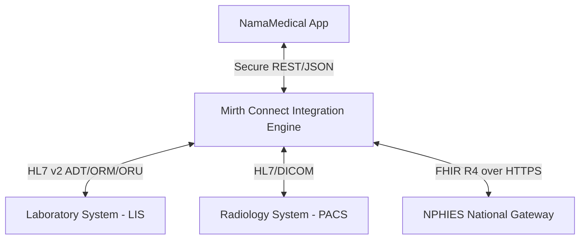

# سجل القرار المعماري: اعتماد محرك قنوات Mirth Connect للتكامل الرقمي (ADR: Mirth Connect Integration Engine)

**تاريخ القرار**: 2026-07-03  
**الحالة**: معتمد (Approved)  
**سياق المشروع**: نظام إدارة المستشفيات NamaMedical (طبقة الربط الرقمي)  

---

## 1. السياق والمشكلة المطروحة (Context)
يتطلب تشغيل مستشفى NamaMedical بمستوى عالمي ربطه بالعديد من الأنظمة الطبية والتشغيلية الخارجية والداخلية:
- **أنظمة المختبر والأشعة (LIS/RIS/PACS)**: تبادل رسائل HL7 v2 (ADT, ORM, ORU).
- **المنصات الوطنية التنظيمية (NPHIES/ZATCA)**: طلبات الأهلية والمطالبات والفوترة الإلكترونية عبر FHIR و REST APIs.
- **أجهزة المؤشرات الحيوية والتكامل المباشر**: تبادل البيانات عبر بروتوكولات متنوعة (Mawid, Seha).

**الخيارات المتاحة**:
* **الخيار الأول**: بناء المترجمات والموزعات (Parsers & Dispatchers) لكل بروتوكول بشكل مباشر داخل تطبيق Express الأحادي (Monolith).
* **الخيار الثاني**: استخدام محرك قنوات معزول ومخصص لإدارة رسائل وتكامل الرعاية الصحية (Healthcare Integration Engine)، مثل **Mirth Connect (NextGen Connect)**.

---

## 2. القرار المعتمد (Decision)
تم اعتماد **الخيار الثاني**: عزل طبقة التكامل بالكامل عن التطبيق الأحادي الأساسي، واستخدام **Mirth Connect** كمحرك قنوات (Integration Engine Broker) وسيط لمعالجة كافة الرسائل الطبية والتشغيلية من وإلى النظام.

---

## 3. المبررات والدوافع الفنية للقرار (Rationale)

### أ. الفصل الهيكلي وحماية الأداء (Decoupling & Performance)
تتطلب معالجة رسائل HL7 وتحويل البيانات السريرية إلى FHIR عمليات معالجة وتحليل مكثفة للنصوص. إن إبقاء هذه العمليات داخل Express سيؤدي لزيادة استهلاك الذاكرة والمعالج والتأثير سلباً على زمن استجابة واجهات مستخدمي العيادات. عزل هذه المعالجة في Mirth يحمي استقرار وموارد المونوليث الأساسي.

### ب. إدارة طوابير الرسائل وضمان التسليم (Robust Queuing & Retry)
يوفر Mirth Connect آلية حفظ متكاملة وقابلة للاستمرار (Persistent Database Queue) للرسائل. في حال توقف نظام LIS أو خادم NPHIES الخارجي:
- يقوم Mirth بحفظ الرسائل مؤقتاً في طابور محلي مشفر.
- إعادة المحاولة التلقائية (Exponential Backoff Retry) دون تعليق أو فقدان للبيانات في NamaMedical.
- استعادة البيانات تلقائياً فور عودة الخدمة الخارجية للعمل.

### ج. مرونة التحويل والتعديل (Data Mapping Flexibility)
يتيح Mirth استخدام مصفيات ومحولات رسائل مرنة (JavaScript Transformers / HL7 Templates) مما يسهل تهيئة مسارات جديدة دون الحاجة لإجراء عملية نشر برمجية كاملة (Full code deploy) للنظام الأساسي.

---

## 4. الطوبولوجيا والموثوقية وأمان البيانات (Security & Topology)

### أ. تدابير أمان البيانات (Data Security Constraints)
- **تشفير القنوات**: جميع الاتصالات بين Mirth والنظام الأساسي أو الأطراف الخارجية تكون مشفرة بالكامل عبر HTTPS/TLS 1.3 مع تفعيل المصادقة المتبادلة (mTLS) لمنصة NPHIES.
- **عزل المستأجرين (Tenant Isolation)**: يقوم Mirth بتمرير وحفظ معرف المستأجر `tenant_id` كحقل إلزامي أساسي في رأس كل رسالة، وتطبيق منطق الحظر عند محاولة دمج رسائل مستأجرين مختلفين.

### ب. خطة التعافي والتراجع (Rollback & DR Plan)
- **النسخ الاحتياطي للقنوات**: يتم حفظ إعدادات القنوات والمحولات برمجياً كملفات XML مشفرة ومصنفة إصدارياً في Git.
- **خطة التراجع**: في حال فشل تحديث قناة تكامل معينة، يتم فورا استيراد إعداد القناة المستقر السابق (Rollback) وتأكيد التشغيل خلال أقل من 5 دقائق دون التأثير على عمل الخادم الرئيسي.
